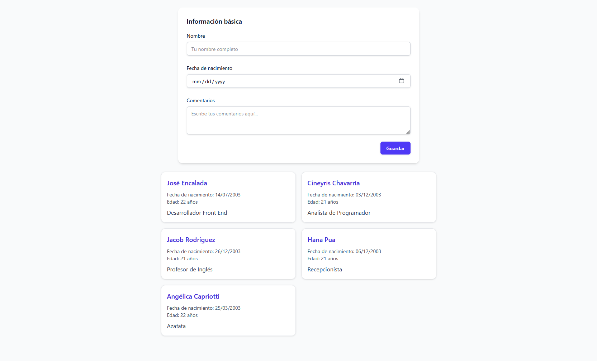

# Formulario de Prueba

Este proyecto es una prueba técnica, desarrollada con ReactJS y TailwindCSS. El formulario incluye validaciones, persistencia con localStorage y diseño responsivo.

## Capturas de pantalla

### Vista inicial del formulario

### Vista responsiva en dispositivos móviles

### Error al dejar campos vacíos

### Error específico en el campo nombre

### Tarjetas agregadas correctamente

## Tecnologías utilizadas

- ReactJS
- TailwindCSS
- localStorage

## Créditos

Formulario basado en el layout de Tailwind UI:  
[Forms Layout](https://tailwindcss.com/plus/ui-blocks/application-ui/forms/form-layouts)
